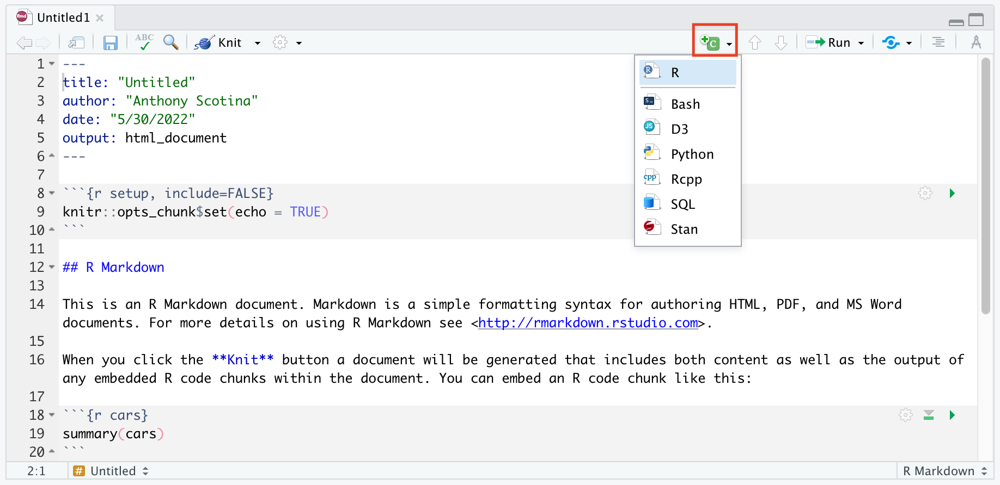

```{r xaringan-themer, include = FALSE}
library(xaringanthemer)
mono_accent(base_color = "#43418A")
```

```{r, include = FALSE}
library(tidyverse)
library(moderndive)
library(infer)
```

<!--
pagedown::chrome_print("~/Dropbox/Teaching/02-Brown Courses/CEMA0907-Statistics in the Real World/Slides/Chapter2/Chapter2.html")
-->


# Sarah the chimp

.pull-left[
- In 1978, researchers Premack and Woodruff published a study in *Science* magazine, reporting an experiment where an adult chimpanzee named Sarah was shown videotapes of eight different scenarios of a human being faced with a problem.

- After each videotape showing, she was presented with two photographs, one of which depicted a possible solution to the problem.

- Sarah could pick the photograph with the correct solution for seven of the eight problems!
]

.pull-right[

]

---

# How?!

What are **two possible explanations** for Sarah getting 7 correct answers out of 8?

--

1. Sarah was just guessing and got lucky. 

2. Sarah can do better than just guessing. 

--

**Which explanation do you think is better?**

--

- I think explanation (1) is better. How can you convince me that (1) is *not* the better explanation?

---

# Refuting Explanation (1)

Let's try to look at what Sarah's results would be, **if she just guessed**. 

- What is a simple way to *model* guessing between two choices?

--
.center[
```{r, echo = FALSE, out.width = "25%"}
knitr::include_graphics("coin_flip.png")
```
]
--

Let's define "heads" as a *correct answer* and "tails" as an *incorrect answer*. 

- If Sarah were just guessing ("flipping a coin"), what would be the **expected** number of correct guesses ("heads")?

---

# Simulating Guessing

If Sarah were just guessing, we would *expect* the number of correct guesses to be 4. 

- However, not every set of 8 coin tosses will result in 4 heads. 

- Let's repeat the set of 8 coin tosses many times, to generate the pattern for correct answers that could happen in the long run, **under the assumption that Sarah is just guessing**. 

--
.center[
```{r, echo = F, message = F, warning = F, out.width = "45%"}
obs.data <- c(rep("correct", 7), rep("incorrect", 1)) %>%
  as_data_frame() %>%
  rename(guess = value)

obs.data %>%
  specify(response = guess, success = "correct") %>% 
  hypothesize(null = "point", p = 0.5) %>% 
  generate(reps = 1000) %>% 
  calculate(stat = "prop") %>%
  visualize(obs_stat = 7/8, direction = "right") +
  labs(x = "Proportion of correct answers", y = "Count") +
  ggtitle("")
```
]

---

# What do you notice?

The **distribution** of the rate of correct answers, **under the assumption that Sarah was guessing**, is centered at 0.50 (50%, or 4 correct answers out of 8). 

- The red line indicates the **observed proportion** of correct answers, 7 out of 8 (87.5%). 

The majority of the distribution lies between 0.25 and 0.75. 

- This means that, if Sarah were actually guessing, then it would be *highly unlikely* to observe 7 out of 8 correct answers. 

- Thus, we are fairly convinced that Sarah is doing better than just guessing. 

--

**What if Sarah got 5 correct answers out of 8 instead?** Would we still be convinced of Sarah's ability to do better than guessing?

---

# SPOILER ALERT!!!

We just conducted a **statistical hypothesis test**, and this will be the last topic covered in Statistics in the Real World. 

Let's start from the beginning...

---

class: center, middle

# Course Introductions

---

# Who am I?

.pull-left[

**Anthony Scotina** (he/him)

- Asst. Prof of Statistics at Simmons University

- Graduated with a Ph.D. in [Biostatistics](https://www.brown.edu/academics/public-health/biostats/home) from Brown University in 2018.

- Website/blog: [https://scotinastats.rbind.io/](https://scotinastats.rbind.io/)

- I used to have many hobbies, but all I do these days is use **R**. 

<br>

- I have an 18-month old cat named **Moose**!
]

.pull-right[
```{r, echo = FALSE}

```

]
    
---

class: center, middle

# Who are you?

---

# Where are you?

Statistics in the Real World!

**Some information**

*Assignments*:

- **Problem Sets and Participation**: Problem sets will be assigned *almost* daily. See the syllabus for a detailed schedule with due dates. 
    - You will have access to the solution after submitting your problem set to Canvas, where you'll be able to self-assess your work. 
    
- **Weekly Reflection**: After each week, you will be asked to write a short (1-2 paragraphs) reflection piece about your engagement and progress with the course content. 
    
- **R Labs**: There will be R labs completed *in class* during roughly half of the class sessions. There are *not* to be turned in, and are primarily for your own practice. 

- **Mini-Projects**: Groups of 4-5 students will be responsible for weekly *mini-projects*, using material covered in class each week. Short presentations will be given on Fridays.  
    
---

# Where are you?

Statistics in the Real World!

**Some information**

- Our textbook:
    - **ModernDive**: Statistical Inference via Data Science
    - Webpage: [https://moderndive.com](https://moderndive.com)
    - Reading the assigned chapters in the textbook BEFORE EACH CLASS is **crucial**!!!

---

# ModernDive 

.center[
```{r, echo = FALSE, out.width = "65%"}
knitr::include_graphics("md_mobile.png")
```
]

---

# Course Objectives

- Learn how to answer scientific questions with **data**. 

.center[
```{r, echo = FALSE}
knitr::include_graphics("ds_pipeline.png")
```
]

- Statistics isn't just a bunch of numbers and math. We will aim to cover the entire **data science pipeline** in this course. 

---

# Course Objectives

In order to foster a conceptual understanding of statistics, use **real data** whenever possible.

**How can we do this?**

- Two engines:
    1. Mathematics: formulas, approximations, probability theory, etc.
    2. Computing: simulations, random number generating, etc.
  

- In *this* class:
    - Less of (1)
    - More of (2)


---

# The "Engine"

.center[
```{r, echo = FALSE, out.width = "50%"}
knitr::include_graphics("rstudio.png")
```
]

---

class: center, middle

# Getting Started with Data and R

---

# First, let's install R and R Studio...

**Installing R**

- Click [HERE](http://cran.wustl.edu/) to get started. 

--

**Installing R Studio**

- Click [HERE](https://www.rstudio.com/products/rstudio/download/#download) to get started. 

---

# Using R Studio

1. Open **R Studio** (never open **R**). 

2. In the menu bar at the top of your screen: **File** -- **New File** -- **R Markdown...**

.center[
```{r, echo = FALSE, out.width = "75%"}
knitr::include_graphics("r-window.png")
```
]

---

# The R Studio Window

.center[
```{r, echo = FALSE, out.width = "50%"}
knitr::include_graphics("r-window.png")
```
]

**The Four Panels**:

1. **Console** (bottom-left): This is where you can crunch numbers or run/execute commands. 
    - Either type code directly into the console, or run from a *script*...
2. **Editor** (top-left): This is where you can save and edit R code, text, etc.
    - *Save* all of your work in R Markdown (.Rmd) files!!!
3. **Files, Packages, Help, Plots** (bottom-right): See your files, packages, help screens, and plots (more in a few...).
4. **Environment** (top-right): Your current workspace (more in a few...).

---

# Before we get started...

Don't worry. This class does not require you to have *any* experience with computer programming, nor is this a computer science class. 

- "Should all statistics students be programmers? **No!**"

- "Should all statistics students program? **Yes!**"
    - Hadley Wickham, Chief Scientist at R Studio
    
--

Learning R is almost like learning a **new language**. It's difficult, but *incredibly rewarding*. 

- You will learn tools that *actual* statisticians and data scientists use in the **real world**!

---

# R Markdown Basics

**R Markdown** provides a way for R (and python/SQL) users to produce a single file containing code, output, and notes. 

.center[
```{r, echo = FALSE, out.width = "80%"}

```
]

---

# R Markdown Code Chunks

To enter and execute code in an R Markdown document, you'll need to create a **code chunk**. 

.center[
```{r, echo = FALSE, out.width = "80%"}

```
]

- Or just use the **keyboard shortcut** for code chunks...
    - [command]+[option]+[i] for Macs
    - [ctrl]+[alt]+[i] for PC
    
---

# R Markdown Knitting

To compile your R Markdown file into a finished .html (or PDF/Word doc) report, click the **Knit** button. 

.center[
```{r, echo = FALSE, out.width = "80%"}

```
]

🚨**Note**🚨: This will *not work* if your code contains **errors**!

- Knit **early and often** in order to catch little errors *early*!

---

# Code Chunk Options

- `echo = FALSE`: Don't *show* code

- `eval = FALSE`: Don't *evaluate* the code

- `include = FALSE`: Don't show the code or the results

- `message = FALSE`: Don't show the messages
    - This is usually relevant when you load a package but want to suppress the different "welcome" messages they might give. 
    
- `warning = FALSE`: Don't show warning messages

- `out.width = "50%"` Makes a figure half the size (you can change the percentage to fit your needs). 

In general, show your code and your results, but not your messages. 

**Some references**

- R Markdown: The Definitive Guide, by Xie, Allaire, and Grolemund ([here](https://bookdown.org/yihui/rmarkdown/))

- R Markdown Cookbook, by Xie, Dervieux, and Riederer ([here](https://bookdown.org/yihui/rmarkdown-cookbook/))

---

# Vectors

R is built around **vectors**, which are probably the single-most important data structure you'll need to understand for this class. 

--

**Examples**

```{r, echo = FALSE}
c(3, 3, 8, 3, 3, 9)

1:10

seq(2, 20, by = 2)

c("I", "have", "a", "cat", "named", "Moose")

c(TRUE, TRUE, FALSE, FALSE, TRUE)
```

--

Vectors can take elements of *multiple types* (e.g., `numeric`, `character`, `logical`). 

- But each vector's elements must *all* be the **same type**. 

---

# Creating Vectors

There are *many*, **many** ways to create vectors. One way is via the `c()` function:

```{r, eval = FALSE}
c(3, 3, 8)

c("I", "have", "a", "cat", "named", "Moose")

c(TRUE, TRUE, FALSE, FALSE, TRUE)

c("Heads", "Tails")
```

- Each element is separated by a **comma**, and the *output* is a vector. 

---

# Creating Vectors: `a:b`

There are other ways to create vectors that can be *much* more useful than entering individual elements into `c()`. 

- The `:` operator can be used to generate a sequence of *integers* from a **starting** value to an **end** value.

```{r}
1:10

0:1

-1:4
```

---

# Vector Operations

At its core, R is a big, *fancy* statistical calculator. 

- While we can **add**, **subtract**, **multiply**, and **divide** numbers like you can in any calculator, we can also perform these operations (and more!) on vectors. 

```{r}
c(1, 2, 3, 4, 5) + c(6, 7, 8, 9, 10)
```

```{r}
c(1, 2, 3, 4, 5) * c(6, 7, 8, 9, 10)
```

- 🚨 **Note**: Make sure vectors are the same *length* when doing this!

---

# Assignment

We can store vectors under an **alias** so we don't have to keep typing out `c()`, `seq()`, etc. 

```{r}
my_vec = c(1, 2, 3, 4, 5)
```

--

```{r}
my_vec^2

my_vec + my_vec

my_vec/2
```

---

# Logical Vectors

**Logical** vectors are made up of only *two unique "logical" elements*: 

- `TRUE` or `FALSE`

"Behind the scenes", `TRUE` and `FALSE` have values of `1` and `0`, respectively. 

```{r}
c(TRUE, FALSE) + c(TRUE, FALSE)

mean(c(TRUE, TRUE, TRUE, FALSE, FALSE))
```

---

# Logical Operators

Let's create two objects to use with some *logical tests*:

```{r}
moose_age = 2 # rounding up
anthony_age = 32 # rounding down
```

--

Here are some commonly-used **logical operators**

- `==`: equal to
- `!=`: not equal to
- `>`: greater than
- `>=`: greater than or equal to
- `<`: less than
- `<=`: less than or equal to
- `%in%`: true if a value is **in** a vector

---

# Logical Operators

The `==` operator asks whether two objects are **equal**. 

The code below tests the following:

> Moose's age equals Anthony's age. 

```{r}
moose_age == anthony_age
```

--

> Moose's age does *not* equal Anthony's age. 

```{r}
moose_age != anthony_age
```

--

> "Moose's age is greater than Anthony's age. 

```{r}
moose_age > anthony_age
```

---

# Combining Logicals

We can combine *several* logical operators to check multiple conditions!

- `&` for **and**, `|` for **or**

The code below tests the following:

> Moose's age is less than Anthony's age **and** Moose's age is less than 5. 

```{r}
(moose_age < anthony_age) & 
  (moose_age < 5)
```

--

> Moose's age is less than Anthony's age **or** Anthony's age is less than 30. 

```{r}
(moose_age < anthony_age) | 
  (anthony_age < 30)
```

---

# Simulating Data

We won't do this *too much* in this class (we'll usually be working with **real data**), but we can *simulate data* using one of R's many built-in functions. 

Let's randomly sample some data from a **normal distribution** (i.e., a *bell-shaped curve*). 

```{r}
set.seed(907) # Ro control R's random number generator
my_sample = rnorm(n = 1000, mean = 10, sd = 2)

my_sample
```

---

# Some Other Useful Functions

- `mean()`: calculates the **mean** of a vector

```{r}
mean(my_sample)
```

- `sum()`: calculates the **sum** of a vector

```{r}
sum(my_sample)
```

- `summary()`: calculates several **summary statistics** of a vector

```{r}
summary(my_sample)
```

- plus many more!

---

# The `%in%` Operator

The `%in%` operator is *very useful* for checking whether *multiple* elements occur in a vector. 

Recall `my_sample`. Let's check whether each element equals either `5`, `10`, or `15`:

```{r, eval = FALSE}
my_sample == 5 | my_sample == 10 | my_sample == 15
```

- **Note**: The output is a **logical vector** that is the same length as `my_sample`. 

--

Alternatively, we could use %in%:

```{r, eval = FALSE}
my_sample %in% c(5, 10, 15)
```

---

# R Packages

We will be using **R packages** extensively.
- R is *open-source*, which means that members in the community can provide additional functions, data, or documentation in a *package*. 
- Packages are *free* and can be easily downloaded. 

--

**Downloading packages in R Studio**

- **Packages** tab (bottom-right) -- **Install** -- Type package name and press *Install*
- **For now**, install the following packages (separate by a comma when typing the names):
    - `tidyverse`: suite of data science oriented packages
    - `moderndive`: package that accompanies the textbook
    - `infer`: package for statistical inference
    - `openintro`, `babynames`, `nycflights13`: packages with useful datasets

---

# R Packages

.center[
```{r, echo = FALSE, out.width = "50%"}

```
]

**Note**: Once you install a package, *you never have to again*!

- But, you have to *load* them every time you open R Studio. 
- To load a package, use the `library` function. Run the following:
```{r, echo = TRUE, eval = FALSE}
library(tidyverse)
library(nycflights13)
```

---

# `nycflights13` Package

This package contains five data sets saved in five separate **data frames** with information about all domestic flights departing from New York City in 2013:

1. `flights`: Information on all 336,776 flights
2. `airlines`: A table matching airline names and their two letter IATA airline codes (also known as carrier codes) for 16 airline companies
3. `planes`: Information about each of 3,322 physical aircrafts used.
4. `weather`: Hourly meteorological data for each of the three NYC airports. 
5. `airports`: Airport names, codes, and locations for 1,458 destination airports.

- 

**Note**: *Data frames* and *tibbles* are analogous to rectangular spreadhseets you would see in Excel or Google Spreadsheets. 

- Ideally, rows of a data frame correspond to unique *observations*, and columns correspond to *variables*.

---

# `flights` Data Frame

Run the following:

```{r, echo = F}
library(nycflights13)
```

```{r, comment = ""}
flights
```

---

# `flights` Data Frame

A few notes on this dataset...

- A "tibble" is a type of data frame in R. The `flights` data frame has:
    - 336,776 **rows**
    - 19 **columns**
    
- The 19 columns correspond to 19 different **variables**. Some of which are: *year*, *month*, *departure time*, *arrival time*, *carrier*, *origin*, etc.

- By default, we are shown the first 10 rows, since the rest can't fit on the screen. 

---

# Exploring Data Frames

There are many ways to explore a data frame besides what we just accomplished. One of which is through the `View` function. 
- Run the following:
```{r, echo = TRUE, eval = FALSE}
View(flights)
```

- **Note**: R is *case sensitive*. So make sure you use an uppercase "V" in `View`, rather than `view`. 

---

# Exploring Variables

The `$` operator allows us to explore a single variable within a data frame. For example, run the following in your console:
```{r, eval = FALSE}
airlines
```

```{r, eval = FALSE}
airlines$name
```

```{r, eval = FALSE}
airlines$carrier
```

- The `$` extracts only the `name` variable from the `airlines` data frame and returns it as a **vector**. 

---

# Help Files

You can get help in R by entering a `?` before the name of a function or data frame, and a page will appear in the bottom-right panel. 
- Try the following:
```{r}
?flights
```

```{r}
?mean
```

I use the help files **all the time**, and you should too, especially if you're stuck with a specific function!

---

# What's to come?

.center[
```{r, echo = FALSE, out.width = "75%"}

```
]


