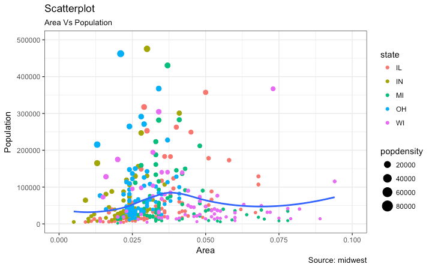
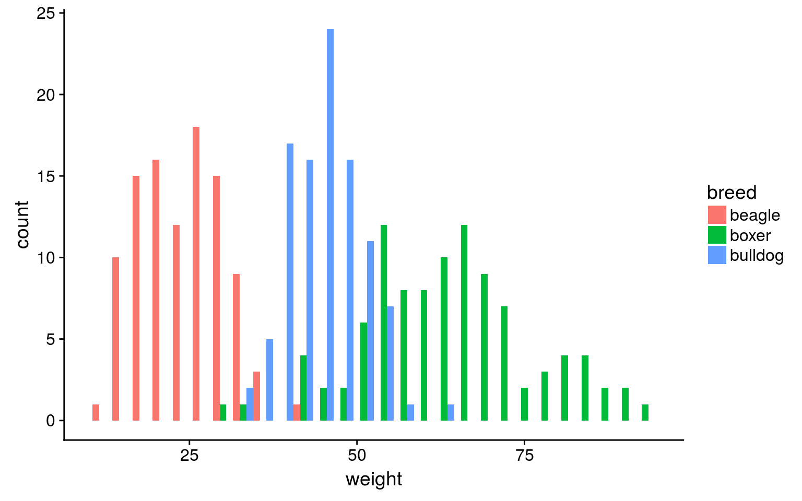
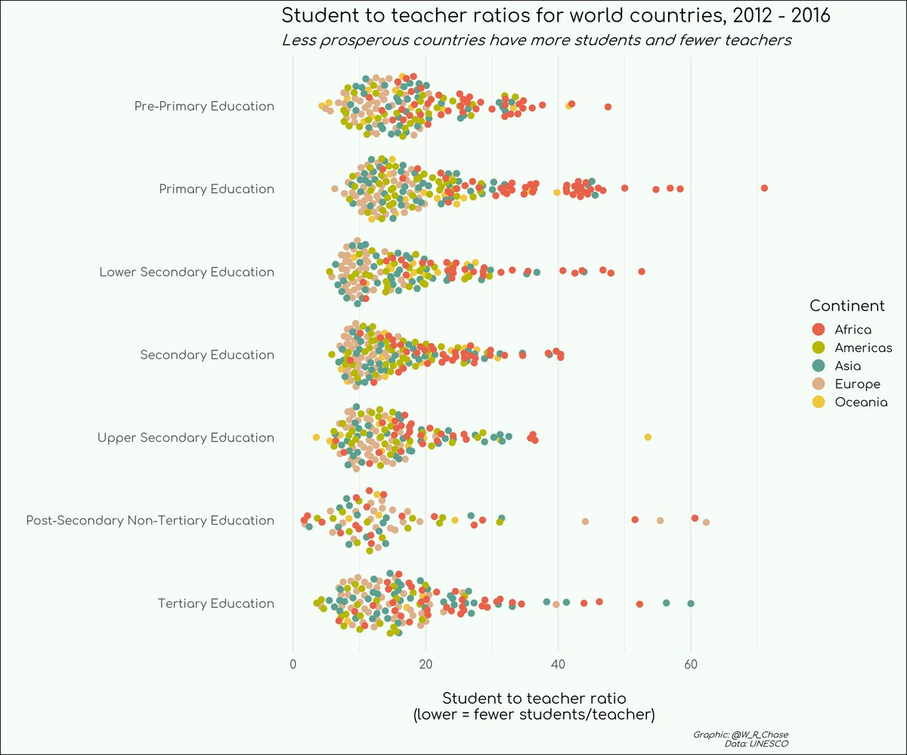

```{r xaringan-themer, include = FALSE}
library(xaringanthemer)
mono_accent(base_color = "#43418A")
```

```{r, include = FALSE}
library(tidyverse)
library(moderndive)
library(infer)
library(gapminder)
```

class: middle, center

# The Grammar of Graphics

---

# (Good) Data Viz in R? 

**ggplot2**

.center[
```{r, echo = FALSE}
knitr::include_graphics("ggplot2_hex.png")
```
]

---

# Needed Packages

```{r}
library(tidyverse)
library(nycflights13)
```

- If you don't have any of these packages, install them first!

---

# Statistical Graphics

.center[
```{r, echo = FALSE}

```
]

---

# Statistical Graphics

.center[
```{r, echo = FALSE}

```
]

---

# Statistical Graphics

.center[
```{r, echo = FALSE, out.width = "75%"}

```
]

---

# The Grammar of Graphics

.pull-left[
```{r, echo = FALSE}
knitr::include_graphics("grammar_paper.png")
```
]

.pull-right[
```{r, echo = FALSE}
knitr::include_graphics("hadley.jpg")
```
]

A theoretical framework for data visualization
- *Idea*: You construct plots the same way that you construct sentences, by combining many different elements. 

---

# What is a statistical graphic?

The **grammar of graphics** defines a "statistical graphic" as the following:
- **statistical graphic**: a mapping of `data` variables to `aes()`thetic attributes of `geom_`etric objects

--

Let's look back at the first statistical graphic on area vs. population in US cities. 

.center[
```{r, echo = FALSE}
tab <- data.frame(data = c("Area", "Population", "State", "PopDensity"), aes = c("x", "y", "color", "size"), geom = c("point, smooth", "point, smooth", "point", "point"))
knitr::kable(tab, format = "html")
```
]

---

# Components of the Grammar

We can break a graphic into three essential components:

1. `data`: the dataset composed of variables that we *map*
2. `geom`: the shape or visual representation of our data. 
    - `geom_` ... point, line, boxplot, histogram, bar, etc.
3. `aes`: aesthetic attributes of the geometric object. 
    - x/y position, color, shape, and size
    
--

.center[
```{r, echo = FALSE}
knitr::include_graphics("grammar-of-graphics.png")
```
]

---

# The `mtcars` Data Frame

```{r, comment = ""}
head(mtcars, 10) # Show the first 10 rows of mtcars
```

```{r, eval = FALSE}
?mtcars
```

---

# Basic Template

How can we make a plot of automobile `wt` (weight, in 1000 lbs) versus `mpg` (miles per gallon)?

--

```{r, eval = FALSE}
ggplot(data = mtcars, mapping = aes(x = wt, y = mpg))
```

- What happened? What do you think we're missing?

---

# Basic Template

```{r, out.width = "50%"}
ggplot(data = mtcars, mapping = aes(x = wt, y = mpg)) + 
  geom_point()
```

---

# Gapminder Data

- Data on global economic, health, and development data from the website [gapminder.org](gapminder.org). 
    - 142 countries represented, from 2007
    
```{r, echo = FALSE}
gapminder_2007 = read.csv("~/Dropbox/Teaching/02-Brown Courses/CEMA0907-Statistics in the Real World/Data/gapminder_2007.csv")

gapminder_2007
```

---

# Gapminder Data

.pull-left[
```{r, echo = FALSE}
ggplot(data = gapminder_2007, aes(x = GDP.per.Capita, y = Life.Expectancy, size = Population, col = Continent)) + 
  geom_point() + 
  labs(x = "GDP per capita", y = "Life expectancy")
```
]

.pull-right[
- `data`?
- `aes`thetic properties?
- `geom_`?
]

---

# Gapminder Data

.center[
```{r, echo = FALSE}
tab <- data.frame(data = c("GDP per Capita", "Life Expectancy", "Population", "Continent"), aes = c("x", "y", "size", "color"), geom = c("point", "point", "point", "point"))
knitr::kable(tab, format = "html")
```
]

Don't worry. We'll see plots that involve more than the "point" `geom`!
- Examples: barplots, histograms, line graphs boxplots

--

**Other components**
- `facet`ing breaks up a plot into small multiples corresponding to the levels of another variable 
- `position` adjustments for barplots
- `labs`: labels for axes and title
- themes

---

class: middle, center

# Five Named Graphs: The 5NG

---

# 5NG#1: Scatterplots

**Scatterplots**, also called **bivariate plots**, allow you to visualize the relationship between two *numerical* variables. 

Let's take another look at the `flights` dataset from the `nycflights13` package. 

- **Question**: What do you think is the relationship between flight **departure delay** and **arrival delay**?
    - If a flight is *delayed*, does it *arrive* at a later time than planned? Or does the flight speed up to accommodate?
    
--

Back in 2019, I attended a conference in Colorado. I flew there using **Frontier Airlines**. So let's `filter` the flights dataset to look at only Frontier Airlines (carrier code: F9) flights:

```{r}
frontier = flights %>%
  filter(carrier == "F9")
```

- We'll cover the specific syntax in this code soon. For now, just run it!

---

# 5NG#1: Scatterplots

```{r, warning = FALSE, out.width = "50%"}
ggplot(data = frontier, mapping = aes(x = dep_delay, y = arr_delay)) + 
  geom_point()
```

---

# 5NG#1: Scatterplots

```{r, warning = FALSE, eval = FALSE}
ggplot(data = frontier, mapping = aes(x = dep_delay, y = arr_delay)) + 
  geom_point()
```

**Let's break this down...**

Within the `ggplot()` function, we specify two of the components of the Grammar of Graphics as arguments (i.e. inputs):

1. The data frame to be `frontier` by setting `data = frontier`.

2. The `aes`thetic mapping by setting `aes(x = dep_delay, y = arr_delay)`. Specifically:
    - the variable `dep_delay` maps to the `x` position aesthetic
    - the variable `arr_delay` maps to the `y` position aesthetic
    
- We add a layer to the `ggplot()` function call using the `+` sign. The layer in question specifies the third component of the grammar: the `geom`etric object. In this case the geometric object are points, set by specifying `geom_point()`.

---

# A Note on Overplotting

Go back to the original scatterplot of `dep_delay` versus `arr_delay`. There is a large clutter of points near 0, indicating no delays in departure or arrival of the flight. 

**The problem**: It is difficult to tell how many points are plotted when there are many clustered around the same values!

--

**The solution**: Change the *transparancy* of the points by using:

```{r, warning = FALSE, eval = FALSE}
ggplot(data = frontier, mapping = aes(x = dep_delay, y = arr_delay)) + 
  geom_point(alpha = 0.2)
```

- By default, the `alpha` option in `geom_point()` is set to `1`.
    - `alpha = 1` means 100% opaque. 
    - `alpha = 0` means 100% transparent. 
    
---

# 5NG#2: Linegraphs

**Linegraphs** are similar to scatterplots. They show the relationship between two *numerical* variables. 

- However, linegraphs are useful when the `x` variable is *sequential*, or *ordered*. 
- One of the most common ordered numerical variables is time. 

As a first example, let's take a look at the `weather` dataset in the `nycflights13` package. Specifically, let's look at temperature at the JFK airport in New York, between November 1 and November 18:

```{r}
jfk_nov = weather %>%
  filter(origin == "JFK" & month == 11 & day <= 18)
```

(Again, don't worry about the syntax yet. Just copy and run!)

---

# 5NG#2: Linegraphs

In the **Grammar of Graphics**, the *only* difference between a scatterplot and a linegraph is the `geom`.

Let’s plot a linegraph of hourly temperatures (`x = time_hour`, `y = temp`) in `jfk_nov` by using `geom_line()` instead of `geom_point()` like we did for scatterplots:

---

# 5NG#2: Linegraphs

```{r, out.width = "55%"}
ggplot(data = jfk_nov, mapping = aes(x = time_hour, y = temp)) + 
  geom_line()
```

---

# 5NG#2: Linegraphs

```{r, eval = F}
ggplot(data = jfk_nov, mapping = aes(x = time_hour, y = temp)) + 
  geom_line()
```

**Let's break this down...**

There isn't as much to break down this time! The only major difference between this code and the code for scatterplots is the `geom_line()` object. 
- You could easily create a scatterplot between these two variables by using `geom_point()`, It just wouldn't look very nice. (Try it!)

---

# 5NG#3: Histograms

**Histograms** provide a visualization of the *distribution* of a single *numerical* variable. 
- You need only specific an `x` variable in a histogram. 
- By default, the `y` variable is *count*. 

--

Suppose we are interested in the *distribution* of hourly temperature recordings in New York. 

**Histograms** share the following information:
- What is the smallest and largest temperatures, and how often are they observed?
- What is the "center" temperature?
- How are the temperatures spread out?
- What are frequent and infrequent values?
- Is there any skewness?

---

# 5NG#3: Histograms

```{r, warning = FALSE, message = FALSE, out.width = "50%"}
ggplot(data = weather, mapping = aes(x = temp)) + 
  geom_histogram()
```

---

# 5NG#3: Histograms

Before we even discuss the histogram, **always use** `color = "white"` **in** `geom_histogram()`!!!

```{r, warning = FALSE, message = FALSE, out.width = "45%"}
ggplot(data = weather, mapping = aes(x = temp)) + 
  geom_histogram(color = "white")
```

---

# 5NG#3: Histograms

.pull-left[
```{r, warning = FALSE, message = FALSE, echo = F, eval = T}
ggplot(data = weather, mapping = aes(x = temp)) + 
  geom_histogram(color = "white")
```
]

.pull-right[
What do we notice about the histogram?

- The **middle** temperatures are around 55-60 degrees Fahrenheit. 
- The **range** is from ~10 degrees to ~100 degrees. 
- There are **two prominent peaks** at ~30 degrees and ~70 degrees. 
    - What do you think could account for these two peaks?
]

---

# Changing the color of histograms

The `color` argument changes the *outline* of each bar in the histogram. 

If you want to change the color of each *bar*, use the `fill` argument. 
- Try running this!

```{r, eval = FALSE, echo = TRUE}
ggplot(data = weather, mapping = aes(x = temp)) + 
  geom_histogram(color = "white", fill = "red")
```

- R has **many colors**. See [this](http://www.stat.columbia.edu/~tzheng/files/Rcolor.pdf). 

---

# Facets

**Faceting** is used when we’d like to split a particular visualization of variables by another variable.

For example, we agreed that the two prominent peaks in the histogram of temperature might be due to seasons (colder in winter, warmer in summer). 
- Therefore, let's construct multiple histograms of `temp`, one for each `month`:
```{r, echo = TRUE, eval = FALSE}
ggplot(data = weather, mapping = aes(x = temp)) + 
  geom_histogram(color = "white") + 
  facet_wrap( ~ month)
```

---

# Facets

```{r, out.width = "50%", warning = FALSE, message = FALSE}
ggplot(data = weather, mapping = aes(x = temp)) + 
  geom_histogram(color = "white") + 
  facet_wrap( ~ month)
```

---

# Facets

**Facets** form *another layer* to our grammar of graphics. 

- After we add the `geom`, we have the option of adding a `facet` if we want separate figures for levels of a variable. 

The syntax is `facet_wrap( ~ VARIABLE NAME)`

---

# 5NG#4: Boxplots

**Boxplots**, like **histograms**, show the *distribution* of a *numerical* variable. 
- However, boxplots are constructed using information provided by a **five-number summary**. 

**Five-number summary**: Minimum, 1st quartile (25th percentile), Median, 3rd quartile (75th percentile), Maximum

In R, a five-number summary of any numerical variable can be found using the `summary()` function:

```{r, comment = ""}
summary(jfk_nov$temp)
```

(Recall that we can use the `$` operator to view individual variables in a data frame!)

---

# 5NG#4: Boxplots

```{r, echo = F, eval = T, out.width = "65%", message = FALSE}
five_number <- tibble(
  temp = summary(jfk_nov$temp)[c(1,2,3,5,6)]
)
jfk_nov %>% 
  ggplot(mapping = aes(x = factor(month), y = temp)) +
  #geom_boxplot() +
  geom_hline(data = five_number, aes(yintercept=temp), linetype = "dashed") +
  geom_jitter(width = 0.05, height = 0.5, alpha = 0.1) +
  labs(x = "")
```

---

# 5NG#4: Boxplots

```{r, echo = F, eval = T, out.width = "65%", message = FALSE}
five_number <- tibble(
  temp = summary(jfk_nov$temp)[c(1,2,3,5,6)]
)
jfk_nov %>% 
  ggplot(mapping = aes(x = factor(month), y = temp)) +
  geom_boxplot() +
  geom_hline(data = five_number, aes(yintercept=temp), linetype = "dashed") +
  geom_jitter(width = 0.05, height = 0.5, alpha = 0.1) +
  labs(x = "")
```

---

# 5NG#4: Boxplots

**What does the boxplot tell us?**

Between November 1 and November 18 at JFK Airport in New York...
- 25% of points fall below the bottom edge of the box, which is the **first quartile** of 44.06 degrees. 
- 75% of points fall above the top edge of the box, which is the **third quartile** of 55.94 degrees. 
- 50% of points fall between the first and third quartiles, or between 44.06 and 55.94 degrees. 
    - This is the **interquartile range (IQR)**. 

---

# 5NG#4: Boxplots

**How can we make a boxplot?**

--

Same as before, we just need to change the `geom_` object. 

```{r, echo = TRUE, eval = FALSE}
ggplot(data = jfk_nov, mapping = aes(y = temp)) + 
  geom_boxplot()
```

(Notice we also use the `y` variable here, not the `x`!)

---

# Side-by-side Boxplots

Boxplots are more interesting when you compare several side-by-side. 

Let's use the `weather` dataset to compare `temp` by `month`, as we did before with histograms. 

```{r, eval = FALSE, warning = FALSE}
ggplot(data = weather, mapping = aes(x = factor(month), y = temp)) + 
  geom_boxplot()
```

---

# Side-by-side Boxplots

```{r, echo = FALSE, eval = TRUE, warning = FALSE, out.width = "50%"}
ggplot(data = weather, mapping = aes(x = factor(month), y = temp)) + 
  geom_boxplot()
```

- In the `weather` dataset, R thinks `month` is **numerical** (since it appears in the data as numbers) when it is really **categorical**. We convert `month` to categorical using `factor(month)`. 

---

# Side-by-side Boxplots

```{r, echo = FALSE, eval = TRUE, warning = FALSE, out.width = "50%"}
ggplot(data = weather, mapping = aes(x = factor(month), y = temp)) + 
  geom_boxplot()
```

- The dots representing values falling outside the whiskers are called outliers. These can be thought of as anomalous values.

---

# 5NG#5: Barplots

**Barplots** provide a visualization of the distribution of a *categorical variable*. 

- The x-axis shows *levels* of the categorical variable. 
- The y-axis shows the *count* of observations within each level. 

--

**One complication**: Are your data *counted* or *pre-counted*?

---

# Counted vs. Pre-counted Categories

Consider two data frames of the same categorical variable:
- `fav.plot`: Which do you think is better: barplots or pie charts?

---

# Counted vs. Pre-counted Categories

**Counted** 

.center[
```{r, echo = FALSE}
tab.count <- data.frame(fav.plot = c("Pie Chart", "Barplot"), count = c(2, 5))
knitr::kable(tab.count, format = "html")
```
]

--

**Pre-counted**

.center[
```{r, echo = FALSE}
tab.pre <- data.frame(fav.plot = c("Pie Chart", "Barplot", "Barplot", "Barplot", "Barplot", "Pie Chart", "Barplot"))
knitr::kable(tab.pre, format = "html")
```
]

---

# Barplots for Pre-counted Data

- Use `geom_bar()`:

```{r, echo = T, out.width = "50%"}
ggplot(data = tab.pre, mapping = aes(x = fav.plot)) + 
  geom_bar()
```

---

# Barplots for Counted Data

- Use `geom_col()`:

```{r, echo = T, out.width = "50%"}
ggplot(data = tab.count, mapping = aes(x = fav.plot, y = count)) + 
  geom_col()
```

---

# Barplot of `carrier`

Using the `flights` data frame, create a boxplot of the `carrier` variable. 
- **Hint**: The `carrier` variable is **pre-counted**, so use `geom_bar()`. 

--

**Solution**

```{r, eval = F}
ggplot(data = flights, mapping = aes(x = carrier)) + 
  geom_bar()
```

---

# Multiple Categorical Variables

Suppose we want to make different-colored bars for different airports (`origin`). 
```{r, out.width = "45%"}
ggplot(data = flights, mapping = aes(x = carrier, fill = origin)) + 
  geom_bar()
```
