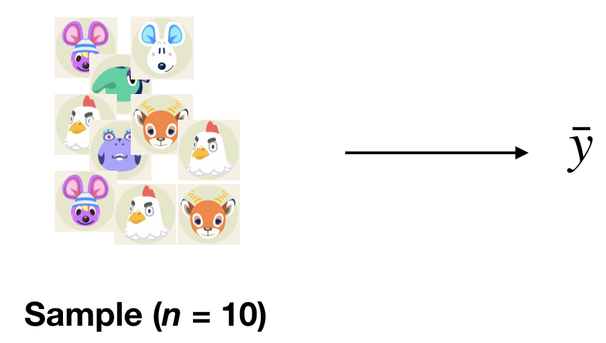

```{r xaringan-themer, include = FALSE}
library(xaringanthemer)
mono_accent(base_color = "#43418A")
```

```{r, include = FALSE}
library(tidyverse)
library(moderndive)
library(infer)
library(mosaic)
library(nycflights13)

knitr::opts_chunk$set(warning = FALSE, message = FALSE, 
                      echo = TRUE, dpi = 300)
```

class: center, middle, frame

# Introduction

---

# Recap

If *sampling* of a sample of size $n$ is done at **random**, then the resulting sample is *unbiased* and **representative** of the **population**. 
- Thus, the **sample statistic** from the representative sample represents a "good guess" of the (unknown) **population parameter**. 

Using the `bowl` data frame in the `moderndive` R package, we used the **sample proportion**, $\hat{p}$, to estimate the **population proportion**, $p$. 

Generally, we will use the *sample* to **infer** about the *population*. 

---

# In reality...

In *most cases*, we don't have the population values like we did with the `bowl` data frame, and we don't take many samples from the population. 

- We only have a single sample of data from a larger population!

While the **sample statistic** represents our single *best guess* at the (unknown) **population parameter**, we would also like to create a *range of plausible values* for the population parameter. 

- This range is called a **confidence interval**. 

--

How do we use a single sample to get some idea of how other samples might vary in terms of their statistic values?

- **Bootstrapping**

---

# Needed Packages 

```{r}
library(moderndive)
library(tidyverse)
library(infer)
```

---

class: center, middle, frame

# Bootstrapping

---

# `pennies_sample`

```{r, comment = ""}
pennies_sample
```

**Question**: What is the *average year* on US pennies in 2019?

- Can we use the sample of 50 pennies to help answer this question?

---

# Exploratory Data Analysis: Data Visualization

.pull-left[
```{r, echo = FALSE}
gf_histogram( ~ year, data = pennies_sample)
```
]

.pull-right[
Most of the ages are between 1980 and 2000, though there is a large spike in 2018. 

- If this sample is **representative** of the population of US pennies, we would expect the distribution of *all* pennies' year to have a similar shape. 
]

---

# Exploratory Data Analysis: Summary Statistics

Because we are interested in the **mean** year of *all* US pennies in 2019, let's calculate the **sample mean**, $\bar{x}$, of our 50 pennies using `mean()`:
```{r, comment = ""}
x_bar = mean(pennies_sample$year)
x_bar
```

Therefore, our **point estimate** is $\bar{x}=1995.44$. This represents our *best guess* at the **population mean** age of all US pennies, $\mu$. 

---

# Sampling Variability

**Why are we interested in this?**

*Every* **sample statistic** has some variability. 
- Suppose you take a random sample of 50 Brown University students and five are left-handed. 

--

If you take a *different* random sample of 50 Brown University students, how many would you *expect* to be left-handed?
- Suppose three are left-handed. Is that surprising?
- Would 40 left-handed students out of 50 be surprising?

**Two ways to measure variability**:

1. Theory (Central Limit Theorem, etc.) -- AP/Introductory Statistics
2. **Simulation** (e.g., *bootstrapping*) -- **THIS CLASS**

---

# The Bootstrapping Process

Bootstrapping uses a process of sampling **with replacement** from our original sample to create new bootstrap samples of the **same size** as our original sample.

We can generate a *single bootstrap sample* by using the `rep_sample_n()` function from earlier:
```{r, echo = FALSE}
set.seed(12)
```

```{r, comment = ""}
bootstrap_sample1 = 
  rep_sample_n(pennies_sample, size = 50, reps = 1, replace = TRUE)
```

--

- Notice that `size=50`. This *isn't an arbitrary number*. When bootstrapping, the `size` value will *always be the same as the original sample size*!

- We add a new argument to `rep_sample_n()`, `replace = TRUE`. This means that when a penny is selected for our **bootstrap sample**, it has the chance to be selected *again*. 

---

# Bootstrapping

When using the bootstrap, it might help to think of our original sample *as if* it were the population. 

- If the sample is *representative*, then the population might as well just be tons of copies of the original sample. 

--

**Example**:

Meet some "data":
.center[
```{r, echo = FALSE, dpi = 300}
knitr::include_graphics("ac_beau.jpeg")

knitr::include_graphics("ac_rod.jpeg")

knitr::include_graphics("ac_goose.jpeg")
knitr::include_graphics("ac_dora.jpeg")
```
]

---

# How Bootstrapping Works

**One Sample** $\implies$ *One Sample Statistic*

.center[
```{r, echo = FALSE, dpi = 300}

```
]

---

# How Bootstrapping Works

**One Sample** $\implies$ **Bootstrap Sample** $\implies$ *Bootstrap Statistic*

.center[
```{r, echo = FALSE, dpi = 300}
knitr::include_graphics("bootstrap2.png")
```
]

---

# How Bootstrapping Works

**One Sample** $\implies$ **Bootstrap Samples** $\implies$ *Bootstrap Statistics*

.center[
```{r, echo = FALSE, dpi = 300}
knitr::include_graphics("bootstrap3.png")
```
]

---

# How Bootstrapping Works

**One Sample** $\implies$ **Many Bootstrap Samples** $\implies$ *Many Bootstrap Statistics*

.center[
```{r, echo = FALSE, dpi = 300}
knitr::include_graphics("bootstrap4.png")
```
]

---

# Why Bootstrapping Works

If the sample is **representative**, the *population* might as well be *many copies of the sample*. 

.center[
```{r, echo = FALSE, dpi = 300}
knitr::include_graphics("bootstrap5.png")
```
]

---

# Why Bootstrapping Works

If the sample is **representative**, the *population* might as well be *many copies of the sample*. 

.center[
```{r, echo = FALSE, dpi = 300}
knitr::include_graphics("bootstrap6.png")
```
]

---

class: center, middle, frame

# The `infer` Package for Statistical Inference

---

# `infer`

The `infer` package provides a useful resource in building **confidence intervals** and conducting **hypothesis tests** (more on those later). 

There are several *verb-named functions* that build in order. 

.center[
```{r, echo = FALSE, out.width = "30%"}

```
]

---

# Step 1: `specify()`

The `specify()` function is used primarily to choose which variables will be the focus of the statistical inference.
- This is done using the `response = ` argument:

```{r, comment = ""}
pennies_sample %>%
  specify(response = year)
```

---

# Step 2: `generate()` replicates

After `specify()`-ing the main variable of interest, we use `generate()` to generate **bootstrap samples** (i.e., *replicates*) from the original sample. 
- Here, we can easily create 1,000 bootstrap samples:
```{r}
pennies_sample %>%
  specify(response = year) %>%
  generate(reps = 1000, type = "bootstrap")
```

If you view this dataset, you will see that there are 50,000 rows! 
- We took 1,000 bootstrap samples, each of size 50. 

---

# Step 3: `calculate()` summary statistics

Once we have 1,000 **bootstrap samples**, we need to calculate a **summary statistic** for each sample. 
- In this example, the *summary statistic* is the **mean**. 
```{r, message = FALSE, eval = FALSE}
pennies_sample %>% 
  specify(response = year) %>% 
  generate(reps = 1000, type = "bootstrap") %>% 
  calculate(stat = "mean")
```

--

This generates a data frame with 1,000 rows: each row containing the sample mean of the respective **bootstrap sample**. 
- This set of 1,000 sample means represents a **bootstrap distribution**. 

---

# Step 4: `visualize()` the results

.center[
```{r, echo = FALSE}

```
]

---

# Step 4: `visualize()` the results

```{r, out.width = "40%", warning = FALSE}
pennies_sample %>% 
  specify(response = year) %>% 
  generate(reps = 1000, type = "bootstrap") %>% 
  calculate(stat = "mean") %>%
  visualize()
```

---

class: center, middle, frame

# Confidence Intervals

---

# Confidence Intervals

A **confidence interval** gives a range of *plausible values* for a population parameter. 
- Using *only* a **sample statistic** to estimate a parameter is like fishing in a murky lake with a spear, and using a confidence interval is like fishing with a net.

.center[
```{r, echo = FALSE, out.width = "50%"}
knitr::include_graphics("fishing.png")
```
]

---

# Confidence Intervals

Confidence intervals depend on a specified **confidence level**, with...
- *higher* confidence levels corresponding to *wider* confidence intervals, and
- *lower* confidence levels corresponding to *narrower* confidence intervals. 

Common **confidence levels** include 90%, 95%, and 99%.

--

Using the **bootstrap distribution** (i.e., `bootstrap_distribution` from earlier), we can use the **percentile method** to obtain a confidence interval for the population mean age of US pennies.

---

# The Percentile Method

The only thing you need to do here is to use the `get_ci()` function from the `infer` package:

```{r, comment = ""}
percentile_ci = pennies_sample %>% 
  specify(response = year) %>% 
  generate(reps = 1000, type = "bootstrap") %>% 
  calculate(stat = "mean") %>%
  get_ci(level = 0.95, type = "percentile") 

# 0.95 and "percentile" are default values
percentile_ci
```

--

The **percentile method** gives us the 2.5th and the 97.5th *percentiles* of the bootstrap distribution. 

- Our range of plausible values for the mean year of US pennies in 2019 is between 1991 and 2000 years, with **95% confidence**. 

---

# Visualizing the CI

A cool thing you can do in R is to use the `visualize()` function to plot the *confidence interval* on top of the bootstrap distribution histogram. 
- Run the following:

```{r, eval = FALSE, warning = FALSE}
pennies_sample %>% 
  specify(response = year) %>% 
  generate(reps = 1000, type = "bootstrap") %>% 
  calculate(stat = "mean") %>%
  visualize()  + 
  shade_ci(endpoints = percentile_ci, 
           color = "hotpink", fill = "chartreuse")
```

---

class: center, middle, frame

# Interpreting the Confidence Interval

---

# Interpreting the Confidence Interval

We have done a lot of calculations in this module, but *what does it all mean*?

The purpose of confidence intervals is to provide a range of plausible values for an *unknown* parameter (in this case, the population mean $\mu$). 
- Using the **percentile method**, one such interval is $[1991, 2000]$. 

--

Let's modify `pennies_sample` to **simulate** a population of US pennies.
```{r, comment = ""}
pennies_pop = pennies_sample %>%
  sample_n(10000, replace = TRUE)

mean(pennies_pop$year)
```

--

Thus, $\mu=1995$ (approx.) which *falls in the confidence interval*. 

---

# Using a new `pennies_sample`

We can use the `infer` pipeline to re-do the entire set of exercises today, but using a *new* sample of pennies from the `pennies` data frame:
```{r, echo = FALSE}
set.seed(45)
```

```{r, message = FALSE}
bootstrap_distribution_new = pennies_pop %>%
  rep_sample_n(size = 40, reps = 1) %>%
  specify(response = year) %>% 
  generate(reps = 1000) %>% 
  calculate(stat = "mean")
bootstrap_distribution_new %>%
  get_ci()
```

This new confidence interval *also* contains $\mu$ (1995). 

---

# Calculating Many CIs

We can repeat this process 100 times (don't worry about the code), and generate 100 95% confidence intervals:

.center[
```{r, echo = FALSE, dpi = 300, warning = FALSE, out.width = "60%"}

```
]

---

# Calculating Many CIs

Using 95% as our **confidence level**, *approximately* 94 of the CIs contained the population mean $\mu=1995.133$, while 6 did not. 

**What does this mean?**

- The procedure we have used to generate confidence intervals is "*95% reliable*" in that we can expect it to include the true population parameter **approximately** 95% of the time *if the process is repeated*.

---

# Back to our example...

**What is a precise interpretation of a confidence interval?**

Recall our *original 95% confidence interval* using the **percentile method**: $[1991, 2000]$. 

**Interpretation**: We are **95% confident** that the average year on US pennies in 2019 is between 1991 and 2000, using the **percentile method**. 

---

# Interpretating a CI

In general...

**Precise interpretation**: If we repeated our sampling procedure a large number of times, we expect about 95% of the resulting confidence intervals to capture the value of the population parameter.

**Short-hand interpretation**: We are 95% “confident” that a 95% confidence interval captures the value of the population parameter.

---

# Width of Confidence Interval

**Confidence level**

In order to be more confident in our best guess of a range of values, we need to widen the range of values.
- The higher the *confidence level*, the wider a confidence interval will be. 

--

```{r}
pennies_sample %>% 
  specify(response = year) %>% 
  generate(reps = 1000, type = "bootstrap") %>% 
  calculate(stat = "mean") %>% 
  get_ci(level = 0.80, type = "percentile") 
```

---

# Width of Confidence Interval

**Confidence level**

In order to be more confident in our best guess of a range of values, we need to widen the range of values.
- The higher the *confidence level*, the wider a confidence interval will be. 

```{r}
pennies_sample %>% 
  specify(response = year) %>% 
  generate(reps = 1000, type = "bootstrap") %>% 
  calculate(stat = "mean") %>% 
  get_ci(level = 0.95, type = "percentile") 
```

---

# Width of Confidence Interval

**Confidence level**

In order to be more confident in our best guess of a range of values, we need to widen the range of values.
- The higher the *confidence level*, the wider a confidence interval will be. 

```{r}
pennies_sample %>% 
  specify(response = year) %>% 
  generate(reps = 1000, type = "bootstrap") %>% 
  calculate(stat = "mean") %>% 
  get_ci(level = 0.99, type = "percentile") 
```

---

# Impact of Sample Size

In general, *larger sample sizes tend to produce narrower confidence intervals*. 
- As our sample size increases, our estimate gets more *precise*. 
    - Also, the **standard error decreases**. 
    
For example, a 95% confidence interval with $n=50$ will be *narrower* than a 95% confidence interval with $n=25$. 
